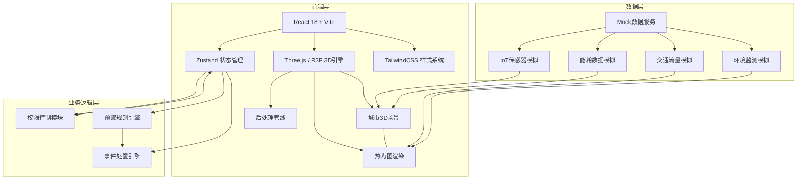
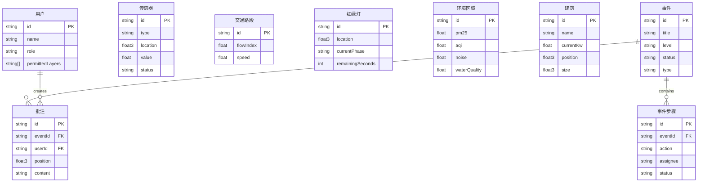

## 1. 架构设计



## 2. 技术说明

- **前端框架**：React@18 + TypeScript
- **构建工具**：Vite
- **3D引擎**：Three.js + @react-three/fiber + @react-three/drei + @react-three/postprocessing
- **状态管理**：Zustand（轻量、支持订阅选择器、适合高频更新）
- **样式方案**：TailwindCSS@3 + CSS Variables（主题色动态切换）
- **图表库**：Recharts（轻量级，适合能耗趋势/统计图表）
- **后端服务**：无独立后端，使用前端Mock数据模拟实时数据流
- **数据库**：无，使用内存数据结构模拟

## 3. 路由定义

| 路由 | 用途 |
|------|------|
| `/` | 3D孪生主场景（默认首页），包含城市3D视图与所有叠加图层 |
| `/traffic` | 智能交通调度面板（弹窗/侧栏形式嵌入主场景） |
| `/environment` | 环境监测预警面板（弹窗/侧栏形式嵌入主场景） |
| `/energy` | 能耗分析面板（弹窗/侧栏形式嵌入主场景） |
| `/events` | 事件处置中心（弹窗/侧栏形式嵌入主场景） |
| `/admin` | 权限管控后台（独立页面） |

## 4. API定义

无独立后端，使用Mock数据服务。核心数据接口定义如下：

```typescript
interface SensorData {
  id: string
  type: "iot" | "camera" | "social" | "weather"
  location: [number, number, number]
  value: number
  status: "online" | "offline" | "alert"
  timestamp: number
}

interface TrafficFlow {
  roadId: string
  segments: {
    start: [number, number, number]
    end: [number, number, number]
    flowIndex: number
    speed: number
  }[]
  trafficLights: {
    id: string
    location: [number, number, number]
    currentPhase: "red" | "yellow" | "green"
    remainingSeconds: number
    schedule: { green: number; yellow: number; red: number }
  }[]
}

interface EnvironmentData {
  regionId: string
  metrics: {
    pm25: number
    aqi: number
    noise: number
    waterQuality: number
  }
  heatmapPoints: { position: [number, number, number]; intensity: number }[]
  alerts: Alert[]
}

interface EnergyConsumption {
  buildingId: string
  buildingName: string
  currentKw: number
  trend: { timestamp: number; value: number }[]
  anomalies: { timestamp: number; value: number; type: "spike" | "drop" }[]
}

interface CityEvent {
  id: string
  title: string
  level: "critical" | "major" | "minor"
  status: "detected" | "reported" | "assigned" | "processing" | "resolved"
  type: "traffic" | "environment" | "energy" | "security"
  location: [number, number, number]
  createdAt: number
  steps: EventStep[]
  annotations: Annotation[]
}

interface EventStep {
  action: string
  assignee: string
  status: "pending" | "approved" | "rejected" | "done"
  timestamp?: number
  comment?: string
}

interface Annotation {
  id: string
  userId: string
  position: [number, number, number]
  content: string
  timestamp: number
}

interface User {
  id: string
  name: string
  role: "city" | "district" | "street" | "enterprise"
  district?: string
  street?: string
  enterprise?: string
  permittedLayers: string[]
}
```

## 5. 服务器架构图

无独立后端服务器。前端内置Mock数据引擎，使用 `setInterval` 模拟高频数据推送，Zustand store 订阅机制实现数据更新到3D渲染的秒级响应。

## 6. 数据模型

### 6.1 数据模型定义



### 6.2 数据定义语言

前端Mock数据，使用TypeScript接口定义。初始数据集包含：
- 200+程序化建筑实例
- 50+道路路段与30+红绿灯
- 100+传感器分布点
- 20+环境监测区域
- 10+待处理事件
- 4级用户角色各2-3个示例账户
